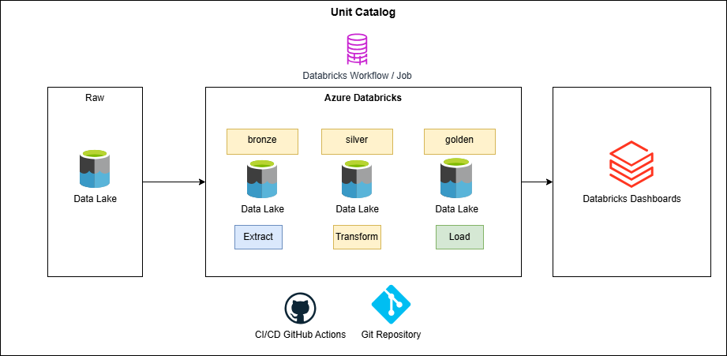
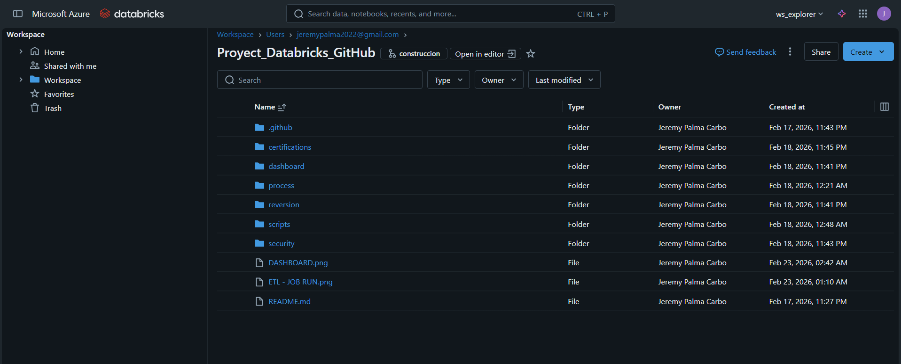
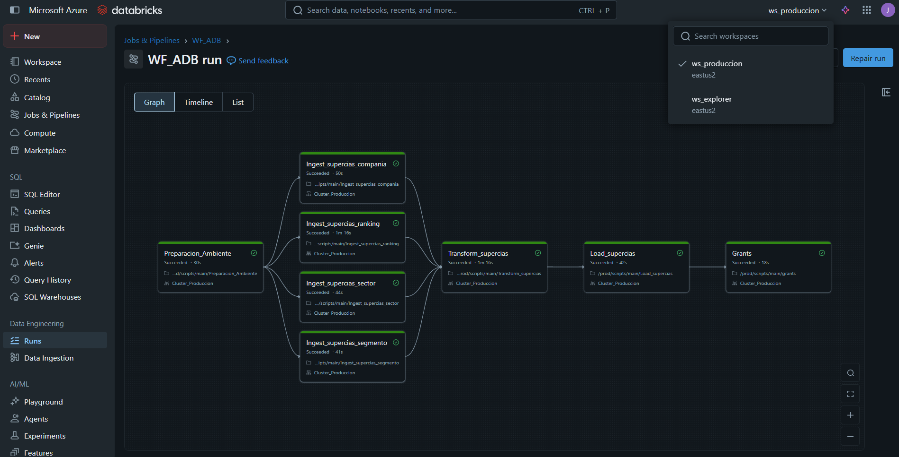
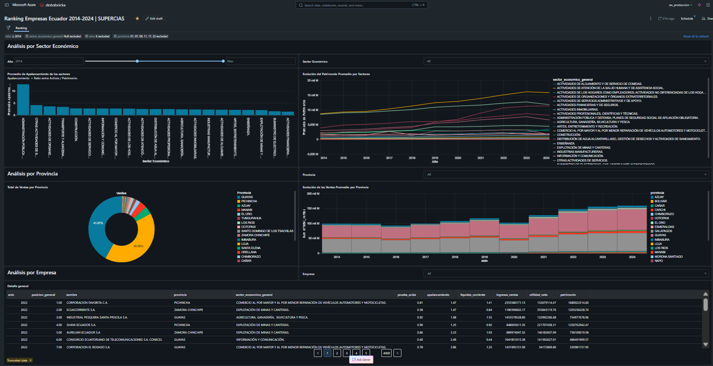

<div align="center">

# 🏢 Ranking de Empresas del Ecuador | SUPERCIAS 

**Pipeline ETL automatizado con arquitectura Medallion y despliegue continuo en Azure Databricks**

[](https://databricks.com/)
[](https://azure.microsoft.com/)
[](https://spark.apache.org/)
[](https://delta.io/)
[](https://github.com/features/actions)


</div>

---

## 🎯 Descripción

Pipeline ETL *enterprise-grade* con Arquitectura Medallion (**Bronze → Silver → Gold**) en Azure Databricks implementando CI/CD completo y Delta Lake para garantizar consistencia ACID. 

Desarrollado por **Jeremy Palma** y tomando como fuente de datos los recursos publicados por la Superintendencia de Compañías, Valores y Seguros, **SUPERCIAS**. 

Todos los insights generados consideran la información de los **Estados Financieros** presentados bajo el estado de **compañías activas**. El análisis de estos datos permite tener una visión de la salud de las empresas/sectores económicos del Ecuador.

---

## ✨ Características

- 🔄 **ETL Automatizado** - Pipeline completo con despliegue automático via GitHub Actions.
- 🏗️ **Arquitectura Medallion** - Separación clara de capas Bronze → Silver → Gold.
- 📊 **Tablas analíticas**: Datos listos para explotación y visualización.
- 🚀 **CI/CD Integrado** - Deploy automático en cada push de dev → prod.
- 📈 **Visualización** - Aplicación de Databricks Dashboards.
- ⚡ **Delta Lake** - ACID transactions y time travel capabilities.
- 🔔 **Monitoreo** - Notificaciones automáticas y logs detallados.
- 🧾 **Gobernanza de Datos** - Notebooks de grants y revocación de permisos.


---

## 🏛️ Arquitectura Medallion

### Flujo de Datos

```
Fuente HTTPS (SuperCias Ranking)
        ↓
🥉 Bronze: Ingesta de compañías, ranking, sector y segmento
        ↓
🥈 Silver: Estandarización y transformación
        ↓
🥇 Gold: Carga de datasets analíticos
        ↓
📈 Dashboard / consumo analítico
```



---

## 📦 Capas del Pipeline


<table>
<tr>
<td width="33%" valign="top">

#### 🥉 Bronze Layer
**Propósito**: Lift and shift

**Tablas**: 
- `unit_catalog_explorer.uc_bronze.supercias_compania` 
- `unit_catalog_explorer.uc_bronze.supercias_ranking` 
- `unit_catalog_explorer.uc_bronze.supercias_sector`
- `unit_catalog_explorer.uc_bronze.supercias_segmento` 

**Características**:
- ✅ Datos extraidos desde origen
- ✅ Timestamp de ingesta
- ✅ Preservación histórica

</td>
<td width="33%" valign="top">

#### 🥈 Silver Layer
**Propósito**: Pre-procesamiento y limpieza

**Tablas**:
- `unit_catalog_explorer.uc_silver.ranking_enriquecido`
- `unit_catalog_explorer.uc_silver.ranking_por_provincia`
- `unit_catalog_explorer.uc_silver.ranking_por_sector`

**Características**:
- ✅ Star Schema
- ✅ Datos normalizados
- ✅ Validaciones completas

</td>
<td width="33%" valign="top">

#### 🥇 Gold Layer
**Propósito**: Analytics-ready

**Tablas**:
- `unit_catalog_explorer.uc_golden.kpi_desempeno_sectorial`
- `unit_catalog_explorer.uc_golden.kpi_ranking_empresarial`
- `unit_catalog_explorer.uc_golden.kpi_ventas_geograficas`

**Características**:
- ✅ Pre-agregados
- ✅ Optimizado para Dashboards
- ✅ Performance máximo


</td>
</tr>
</table>

---

## 📁 Estructura del proyecto

```text
Proyect_Databricks_GitHub/
│
├── .github/
│   └── workflows/
│       └── deploy-notebook.yml                 # CI/CD de despliegue
├── datasets/
│   └── bi_ciiu.csv                             # datasets (opcional)
│   └── bi_compania.csv                         # datasets (opcional)
│   └── bi_segmento.csv                         # datasets (opcional)
│   └── bi_ranking.csv                          # datasets (opcional)
├── process/
│   ├── Ingest_supercias_compania.ipynb         # Bronze: compañías
│   ├── Ingest_supercias_ranking.ipynb          # Bronze: ranking
│   ├── Ingest_supercias_sector.ipynb           # Bronze: sector
│   ├── Ingest_supercias_segmento.ipynb         # Bronze: segmento
│   ├── Transform_supercias.ipynb               # Silver: transformación
│   └── Load_supercias.ipynb                    # Gold: carga analítica
├── scripts/
│   └── Preparacion_Ambiente.ipynb              # Preparación de ambiente
├── security/
│   └── grants.ipynb                            # Asignación de permisos
├── reversion/
│   └── revoke.ipynb                            # Revocación de permisos
├── certifications/             
│   └── credentials.png                         # Certificaciones
├── dashboard/
│   └── DASHBOARD.png                           # Databricks Dashboards 
├── evidence/
│   └── ETL - DEV TAKS.png
│   └── ETL - PROD JOB RUN.png
└── README.md
```


---
## 🛠️ Tecnologías utilizadas


| Tecnología | Propósito |
|:----------:|:----------|
|  | Motor de procesamiento distribuido Spark |
|  | Storage layer con ACID transactions |
|  | Framework de transformación de datos |
|  | Data Lake para almacenamiento persistente |
|  | Automatización del despliegue CI/CD |
|  |  Visualización |


---

## ⚙️ Requisitos previos

- ☁️ Cuenta de Azure con recurso aprovisionado de Databricks (dev. y prod.)
- 💻 Workspace de Databricks configurado
- 🖥️ Cluster activo (nombre: `Cluster_Produccion`)
- 🐙 Repositorio GitHub con Actions habilitado.
- 📦 Azure Data Lake Storage Gen2 configurado
- 📊 Power BI Desktop (opcional para visualización)

---

## 🔄 Despliegue Automático

**GitHub Actions ejecutará**:
- 📤 Deploy de notebooks a `/Workspace/prod`
- 🔧 Creación del workflow `WF_ADB`
- ▶️ Ejecución completa:  Bronze → Silver → Gold
- 📧 Notificaciones de resultados


---

## 🚀 Ejecución manual

1. Ejecutar `scripts/Preparacion_Ambiente.ipynb`.
2. Ejecutar notebooks de ingesta en `process/` (compañía, ranking, sector, segmento).
3. Ejecutar `process/Transform_supercias.ipynb`.
4. Ejecutar `process/Load_supercias.ipynb`.
5. Validar resultados en dashboard y/o tablas finales.




---

## 🔄 CI/CD

El flujo de integración continua se encuentra en:

- `.github/workflows/deploy-notebook.yml`

Este workflow automatiza el despliegue de notebooks para mantener sincronizado el entorno Databricks con el repositorio.

```
├── Deploy notebooks a Produccion → /Workspace/prod
├── Eliminar workflow antiguo (si existe)
├── Buscar cluster configurado
├── Crear nuevo workflow con todas las tareas
├── Ejecutar pipeline automáticamente
└── Monitorear y notificar resultados
```



Trigger 
```
⏰ Schedule: Diario 8:00 AM (Ecuador)
⏱️ Timeout total: 4 horas
 🔒 Max concurrent runs: 1
```


---

## 📈 Dashboards



---

## 🔍 Monitoreo

### En Databricks

**Jobs & Pipelines**:
- Ir a **Jobs & Pipelines** en el menú lateral
- Buscar `WF_ADB`
- Ver historial de ejecuciones

**Logs por Tarea**:
- Click en una ejecución específica
- Click en cada tarea para ver logs detallados
- Revisar stdout/stderr en caso de errores

### En GitHub Actions

- Tab **Actions** del repositorio
- Ver historial de workflows
- Click en ejecución específica para detalles
- Revisar logs de cada step

---

## 👤 Autor

**Jeremy Palma**

Proyecto orientado a ingeniería de datos con enfoque en automatización ETL y analítica empresarial.

[](https://www.linkedin.com/in/jeremy-palma-carbo/)


**Data Analysts** | **Ing. Industrial** | **Azure Databricks** | **Delta Lake** | **CI/CD**

---

## 📄  **Referencia oficial de datos**
- Superintendencia de Compañías, Valores y Seguros (2023): https://appscvsmovil.supercias.gob.ec/ranking/reporte.html

---

<div align="center">

**Proyecto**: Data Engineering - Arquitectura Medallion  
**Tecnología**: Azure Databricks + Delta Lake + CI/CD  
**Última actualización**: 2026-Feb


</div>
